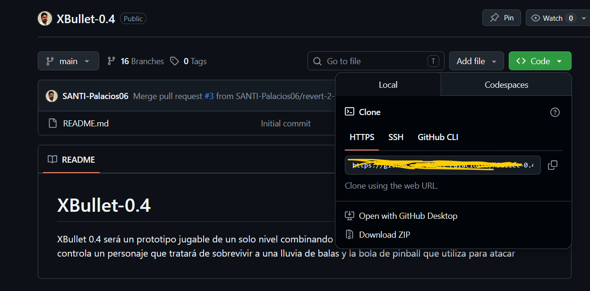
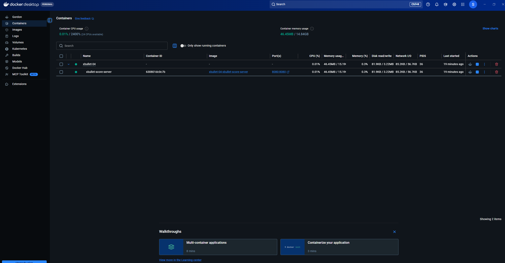
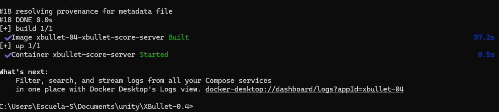
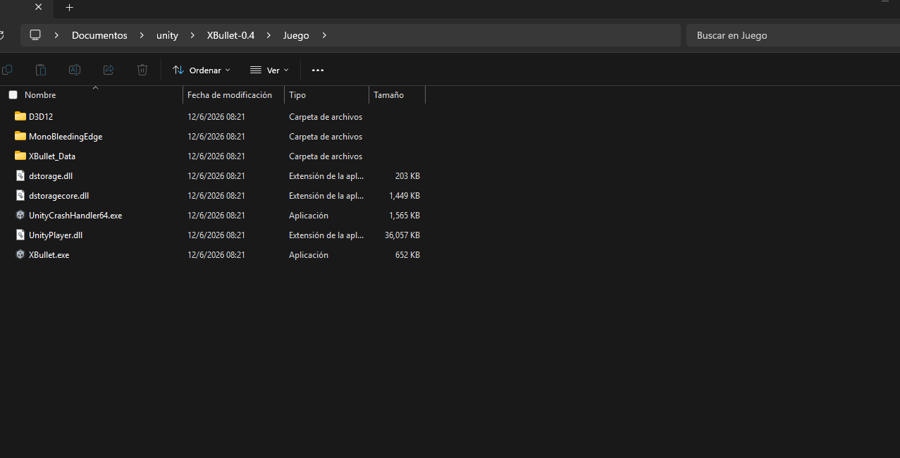

# XBullet-0.4

# XBULLET

## Descripción

XBullet es un juego Hell Shooter que combina las mecánicas de pinball en un solo juego, en donde tu objetivo es derrotar al jefe usando las mecánicas de pinball mientras garantizas tu supervivencia.

La pelota de pinball es la única forma de dañar al jefe, mientras que los disparos del jugador permiten defenderse de los ataques enemigos. El proyecto fue desarrollado en Unity como un prototipo jugable que mezcla elementos de Hell Shooter y Pinball.

---

## Tecnologías utilizadas

* Unity 6000.4.8f1
* C#
* Unity Input System
* Git
* GitHub
* Docker

---

## Dependencias

### Usuario final

* Visual C++ Redistributable 2019 o superior
* DirectX 11 o superior
* Control de Xbox compatible

---

## Estructura del repositorio

```text
XBullet-0.4
│
├── Assets
│   ├── Scenes
│   ├── Scripts
│   ├── Prefabs
│   ├── Materials
│   ├── Audio
│   └── InputSystem
│
├── Packages
│
├── ProjectSettings
│
├── UserSettings
│
├── Documentation
│   ├── Manual_Tecnico
│   ├── Manual_Instalacion
│   └── Manual_Usuario
│
└── README.md
```

---

## Instalación


#### Paso 1 — Clonar el repositorio

Para obtener el proyecto, se debe clonar el repositorio oficial desde GitHub en una carpeta local del equipo.

Primero, se debe asignar un espacio en el disco donde se guardará el proyecto. Se recomienda crear una carpeta en una ubicación fácil de encontrar, por ejemplo:

C:\Users\NombreUsuario\Documents\XBullet

Una vez definida la ubicación, se debe abrir una terminal o Git Bash dentro de esa carpeta y ejecutar el siguiente comando:

git clone https://github.com/SANTI-Palacios06/XBullet-0.4.git

Este comando descarga todos los archivos del proyecto desde el repositorio de GitHub hacia el equipo local.

Cuando termine la descarga, se debe entrar a la carpeta del proyecto con el siguiente comando:

cd XBullet-0.4

Al finalizar este paso, el proyecto estará disponible en la computadora y listo para abrirse desde Unity Hub.




#### Paso 2 — Instalar Doecker y abrir el servidor

Instala docker y una vez instalado abre Docker Desktop y espera a que diga "Engine running"




Abre una terminal en la carpeta del proyecto

construye el docker con el siguiente comando

docker compose build --no-cache && docker compose up -d

Debera aparecerte asi, puede tardar un poco




#### Paso 4 — Conectar control y ejecutar el juego

Antes de ejecutar el juego, se debe conectar un control de Xbox compatible al equipo.

El uso del control de Xbox es obligatorio para jugar correctamente, ya que los controles principales del proyecto están configurados para este tipo de mando.

Una vez conectado el control deber ir a la carpeta que clonaste y buscar la carpeta juego.


Hay selecciona el XBullet.exe y podras jugar

---

## Uso básico

### Servidor

  1. Abre Docker Desktop y espera a que diga "Engine running"
  2. Abre una terminal en la carpeta del proyecto
  3. Ejecuta: docker compose up -d
  Comandos útiles:
  Iniciar servidor   → docker compose up -d
  Ver logs           → docker compose logs -f
  Detener servidor   → docker compose down
  Reconstruir        → docker compose build --no-cache && docker compose up -d
  Ver leaderboard    → http://localhost:8080/api/leaderboard

NOTA: Los datos se guardan aunque cierres el ordenador.
      Solo se borran con: docker compose down -v


### Controles

Uso obligatorio de un control de Xbox.

| Acción            | Botón                         |
| ----------------- | ----------------------------- |
| Moverse           | Stick izquierdo / D-Pad       |
| Disparo           | X                             |
| Disparo cargado   | Mantener X durante un segundo |
| Flipper izquierdo | LB                            |
| Flipper derecho   | RB                            |

---

### Mecánicas principales

#### Disparo

Permite destruir proyectiles enemigos para defenderse.

#### Disparo cargado

Tiene mayor alcance y permite destruir múltiples proyectiles simultáneamente.

#### Pelota de pinball

Es la única forma de infligir daño al jefe.

#### Flippers

Permiten mantener la pelota en juego y dirigirla hacia el jefe.

#### Bumpers 

Enpujan a la pelota

---

## Verificación de instalación

### Usuario final

* El juego inicia correctamente.
* El menú principal aparece.
* Es posible iniciar una partida.
* Los controles responden correctamente.

---

## Documentación

### Wiki

* Way of Work:

  * https://app.notion.com/p/Way-of-Work-d36cca67b3ac829ca1398109c057267a

En este enlace se encuentra toda la documentación de procesos llevados a cabo para el proyecto y la forma de trabajo definida.

* XBullet:

  * (https://app.notion.com/p/X-Bullet-cd5cca67b3ac82e4a8f1818cc4b68a5b)

En este link está toda la documentación del proyecto, incluidos los manuales técnicos, RTM, documentos de desarrollo como análisis, diseño y pruebas, entre otros.

---

## Equipo

Stormbreath Entertainment

### Desarrollador principal

* Santiago Palacios Menes

---

## Versión

Ver 1.0.0
