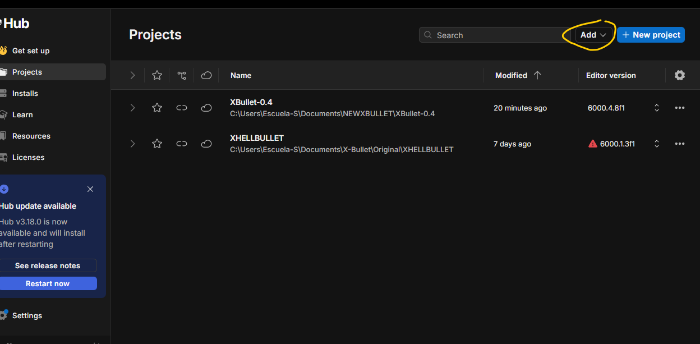
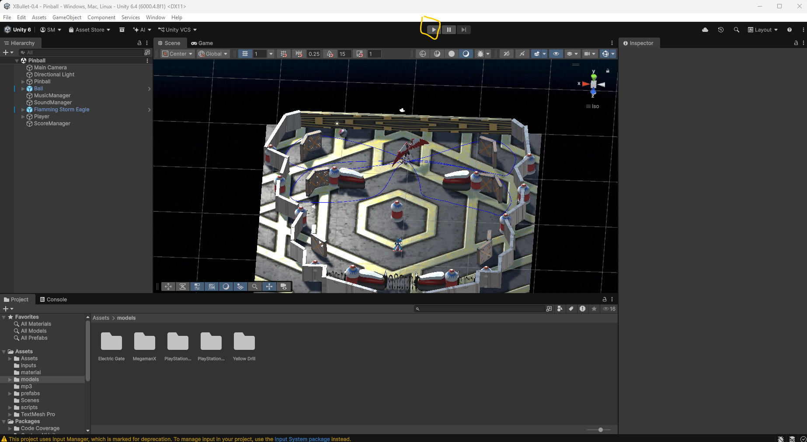

# XBullet-0.4

# XBULLET

## Descripción

XBullet es un juego Hell Shooter que combina las mecánicas de pinball en un solo juego, en donde tu objetivo es derrotar al jefe usando las mecánicas de pinball mientras garantizas tu supervivencia.

La pelota de pinball es la única forma de dañar al jefe, mientras que los disparos del jugador permiten defenderse de los ataques enemigos. El proyecto fue desarrollado en Unity como un prototipo jugable que mezcla elementos de Hell Shooter y Pinball.

---

## Tecnologías utilizadas

* Unity 6000.4.8f1
* C#
* Unity Input System
* Git
* GitHub

---

## Dependencias

### Usuario final

* Visual C++ Redistributable 2019 o superior
* DirectX 11 o superior
* Control de Xbox compatible

---

## Estructura del repositorio

```text
XBullet-0.4
│
├── Assets
│   ├── Scenes
│   ├── Scripts
│   ├── Prefabs
│   ├── Materials
│   ├── Audio
│   └── InputSystem
│
├── Packages
│
├── ProjectSettings
│
├── UserSettings
│
├── Documentation
│   ├── Manual_Tecnico
│   ├── Manual_Instalacion
│   └── Manual_Usuario
│
└── README.md
```

---

## Instalación


#### Paso 1 — Clonar el repositorio

Para obtener el proyecto, se debe clonar el repositorio oficial desde GitHub en una carpeta local del equipo.

Primero, se debe asignar un espacio en el disco donde se guardará el proyecto. Se recomienda crear una carpeta en una ubicación fácil de encontrar, por ejemplo:

C:\Users\NombreUsuario\Documents\XBullet

Una vez definida la ubicación, se debe abrir una terminal o Git Bash dentro de esa carpeta y ejecutar el siguiente comando:

git clone https://github.com/SANTI-Palacios06/XBullet-0.4.git

Este comando descarga todos los archivos del proyecto desde el repositorio de GitHub hacia el equipo local.

Cuando termine la descarga, se debe entrar a la carpeta del proyecto con el siguiente comando:

cd XBullet-0.4

Al finalizar este paso, el proyecto estará disponible en la computadora y listo para abrirse desde Unity Hub.


#### Paso 2 — Instalar Unity y abrir el proyecto

Se debe descargar Unity Hub desde la página oficial de Unity.

Una vez descargado Unity Hub, se debe instalar la versión más reciente de Unity compatible con el proyecto. Para este proyecto se debe usar la versión:

Unity 6000.4.8f1

Después de instalar Unity, se debe abrir Unity Hub.

Dentro de Unity Hub, seleccionar la opción:

Open → Add project from disk



Luego, se debe buscar y seleccionar la carpeta del proyecto que fue clonada desde GitHub.

La carpeta seleccionada debe ser:

XBullet-0.4

Una vez seleccionada la carpeta, Unity comenzará a importar los Assets del proyecto.

Este proceso puede tardar varios minutos dependiendo del equipo, por lo que se debe esperar hasta que Unity termine de cargar completamente el proyecto.

Al finalizar este paso, el proyecto estará abierto en Unity y listo para ser ejecutado o modificado.

#### Paso 3 — Verificar dependencias

Antes de ejecutar el proyecto, se debe verificar que el equipo tenga instaladas las dependencias necesarias para que el juego funcione correctamente.

Las dependencias requeridas para el usuario final son:

* Visual C++ Redistributable 2019 o superior
* DirectX 11 o superior
* Control de Xbox compatible

Visual C++ Redistributable es necesario para que el ejecutable pueda cargar correctamente los componentes requeridos por el sistema.

DirectX 11 o superior es necesario para que el juego pueda mostrar correctamente los gráficos y funcionar con la tarjeta gráfica del equipo.

El control de Xbox compatible es necesario para jugar correctamente, ya que los controles principales del juego están configurados para mando.

En caso de que el juego no inicie correctamente, se debe instalar Visual C++ Redistributable desde Microsoft y verificar que DirectX esté actualizado.

También se recomienda revisar que los drivers de video del equipo estén actualizados para evitar problemas como pantalla negra, errores gráficos o fallos al iniciar el juego.

Al finalizar este paso, el equipo debe contar con las dependencias necesarias para ejecutar XBullet correctamente.

#### Paso 4 — Conectar control y ejecutar el juego

Antes de ejecutar el juego, se debe conectar un control de Xbox compatible al equipo.

El uso del control de Xbox es obligatorio para jugar correctamente, ya que los controles principales del proyecto están configurados para este tipo de mando.

Una vez conectado el control, se debe abrir el proyecto en Unity.

Dentro del proyecto, se debe seleccionar la escena principal del juego y presionar el botón: Play


Al presionar Play, el juego comenzará a ejecutarse dentro del editor de Unity y el usuario podrá jugar.

Durante la ejecución, la consola de Unity mostrará el score del jugador y varios datos relacionados con el funcionamiento del proyecto.

Al finalizar este paso, el juego estará corriendo correctamente dentro de Unity.

---

## Uso básico

### Controles

Uso obligatorio de un control de Xbox.

| Acción            | Botón                         |
| ----------------- | ----------------------------- |
| Moverse           | Stick izquierdo / D-Pad       |
| Disparo           | X                             |
| Disparo cargado   | Mantener X durante un segundo |
| Flipper izquierdo | LB                            |
| Flipper derecho   | RB                            |

---

### Mecánicas principales

#### Disparo

Permite destruir proyectiles enemigos para defenderse.

#### Disparo cargado

Tiene mayor alcance y permite destruir múltiples proyectiles simultáneamente.

#### Pelota de pinball

Es la única forma de infligir daño al jefe.

#### Flippers

Permiten mantener la pelota en juego y dirigirla hacia el jefe.

---

## Verificación de instalación

### Usuario final

* El juego inicia correctamente.
* El menú principal aparece.
* Es posible iniciar una partida.
* Los controles responden correctamente.

---

## Documentación

### Wiki

* Way of Work:

  * https://app.notion.com/p/Way-of-Work-d36cca67b3ac829ca1398109c057267a

En este enlace se encuentra toda la documentación de procesos llevados a cabo para el proyecto y la forma de trabajo definida.

* XBullet:

  * (https://app.notion.com/p/X-Bullet-cd5cca67b3ac82e4a8f1818cc4b68a5b)

En este link está toda la documentación del proyecto, incluidos los manuales técnicos, RTM, documentos de desarrollo como análisis, diseño y pruebas, entre otros.

---

## Equipo

Stormbreath Entertainment

### Desarrollador principal

* Santiago Palacios Menes

---

## Versión

Ver 1.0.0
